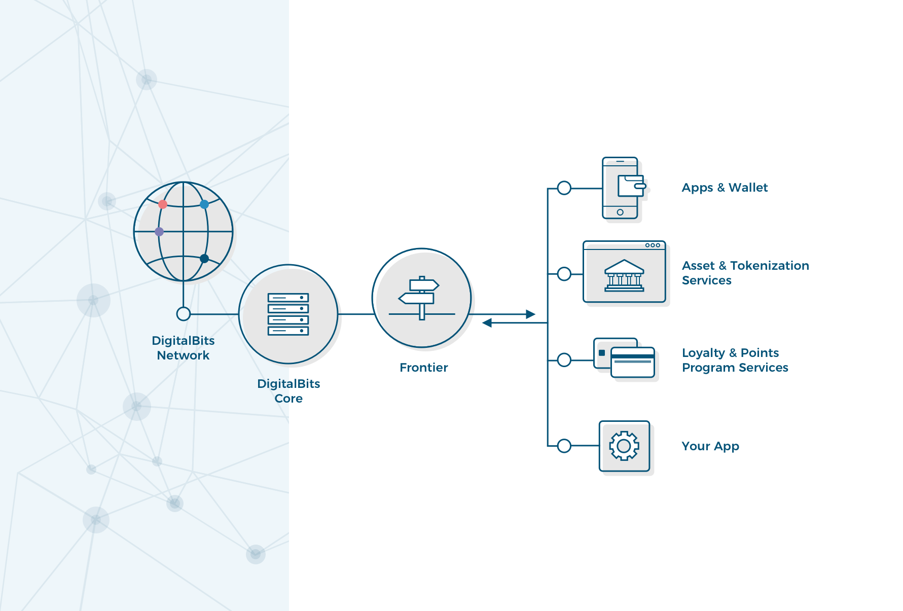

Using the DigitalBits network, you can build mobile wallets, banking tools, smart devices that pay for themselves, and just about anything else you can dream up involving payments! Even though DigitalBits is a complex distributed system, working with it doesn’t need to be complicated.

## API: Frontier

**Most applications interact with the DigitalBits network through [Frontier](https://developer.digitalbits.io/frontier/reference/),** a RESTful HTTP API server. Frontier gives you a straightforward way to submit transactions, check accounts, and subscribe to events. Because it’s just HTTP, you can communicate with Frontier using your web browser, simple command line tools like cURL, or the DigitalBits SDK for your favorite programming language.

<!---The easiest way to install Frontier is by using [**DigitalBits/quickstart** docker image](https://hub.docker.com/r/DigitalBitsOrg/quickstart/). --->

Digitalbits.io maintains [JavaScript](https://github.com/xdbfoundation/js-digitalbits-sdk) and [Go](https://github.com/xdbfoundation/go/tree/master/clients/frontier)-based SDKs for communicating with Frontier. There are also community-maintained SDKs for [Ruby], [Python] and [C#].

## Network Backbone: DigitalBits Core

Behind the scenes, every Frontier server connects to **[DigitalBits Core](../../digitalbits-core/software/admin.html), the backbone of the DigitalBits network.** The DigitalBits Core software does the hard work of validating and agreeing with other instances of Core on the status of every transaction through the [DigitalBits Consensus Protocol](../concepts/scp.html) (SCP). The DigitalBits network itself is a collection of connected DigitalBits Cores run by various individuals and entities around the world. Some instances have a Frontier server you can communicate with, while others exist only to add reliability to the overall network.

<!---The easiest way to install DigitalBits Core is by using [**DigitalBitsOrg/quickstart** docker image](https://hub.docker.com/r/DigitalBitsOrg/quickstart/). --->

You might want to host your own instance of DigitalBits Core in order to submit transactions without depending on a third party, have more control over who to trust, or simply to help make the DigitalBits network more reliable and robust for others.

## Big Picture: The DigitalBits Network

The DigitalBits network is a worldwide collection of DigitalBits Cores, each maintained by different people and organizations. The distributed nature of the network makes it reliable and safe.

All these DigitalBits Cores—the network of nodes—eventually agree on sets of transactions. Each transaction on the network costs a small fee: 100 nibbs (0.00001 <abbr title="digitalbits">XDB</abbr>). This fee helps prevent bad actors from spamming the network. 

To help you test your tools and applications, Digitalbits.io operates a small test network and Frontier instance. [Get started with the testnet.](../concepts/test-net.md)
 
