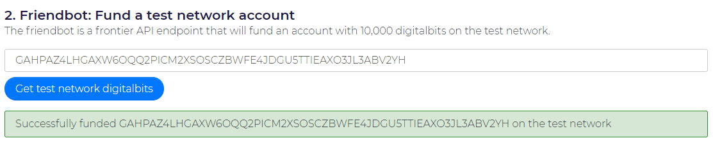

# How to develop an NFT using DigitalBits Blockchain 

# Key Definitions 
## What is an NFT? 

A non-fungible token (NFT) is a unit of data stored on a digital ledger, called a blockchain, that certifies a digital asset to be unique and therefore not interchangeable. NFTs can be used to represent items such as photos, videos, audio, and other types of digital files.

##  What is DigitalBits? 

DigitalBits is a distributed ledger technology that allows anyone to build low-cost and fast financial services. DigitalBits has some of the best documentation and tutorials to help a blockchain developer get started quickly.

## What is a lumen? 

Lumens are the tokens used by the wider DigitalBits Network, to send sums of money and convert currency.

##  What is a DigitalBits Laboratory? 

The DigitalBits Laboratory is a set of tools that enables people to try out and learn about the DigitalBits network. The laboratory can build transactions, sign them, and submit them to the network. It can also make requests to any of the Frontier endpoints.

#  Foolish Assumptions 

## 1. You have an internet connection
## 2. You have a laptop
## 3. You are eager to learn

#  Quick Summary 

We will build a Non-Fungible Token using two keypair accounts issuer and distributor on the DigitalBits testnet . We will make use of the [DigitalBits laboratory](https://laboratory.livenet.DigitalBits.io/) to make the learning experience accessible and awesome.🤗

#  These are the steps that we will cover 

## 1. Create a 2 keypair accounts
## 2. Fund the accounts
## 3. Create a trustline
## 4. Create the NFT
## 5. Lock Issuing account
## 6. Sign and Submit blockchain transaction
## 7. Explore the Accounts and NFT 
#  Step 1: Creating two DigitalBits keypair accounts 

Firstly , let's go to the [DigitalBits laboratory link](https://laboratory.livenet.DigitalBits.io/) and make sure you are using testnet 


Click the <mark>Generate Keypair</mark> blue button to generate the first key pair. Repeat the process to create the second keypair account.


In my case, these are the public keys for the two accounts I created. Make sure you don't mix up the two accounts 😜😜
```text
Distributor
Public Key	GBYIJUGETN5NFORVIRM563KGOLM72EZTNPTGOJFTT6A7AB6F2IRGOGAP

Issuer
Public Key	GAHPAZ4LHGAXW6OQQ2PICM2XSOSCZBWFE4JDGU5TTIEAXO3JL3ABV2YH
```

# Step 2: Funding the two DigitalBits keypair accounts

Next , we fund both accounts with 10,000 lumens on the test network using Friendbot.

Just add the public key for the account you want to fund and click on <mark>Get test network lumens.</mark>




# Step 3: Creating a trustline between the issuer and distributor 
In the third step let's set up a trustline between the issuer and the distributor. A Trustline in DigitalBits explicitly implies that the distribution account trusts the issuing account with the handling of the assets issued.

Firstly , we go to the transaction builder tab. The transaction builder lets us build a new DigitalBits transaction on the DigitalBits Network.


Let's add the public of the issuer in <mark>Source account</mark> field and generate the Transaction Sequence Number by clicking <mark>Fetch next sequence number for account starting with "GBT6JLUJ5J"</mark> blue button below that field.


Next, let's go to the Operation Type field and select <mark>Change Trust</mark> option from the dropdown. On the Asset field, we named our asset <mark>"DBitsNFT"</mark> and added the issuer account public Id. On the <mark>Source Account</mark> field, we added the distributor public Id.


# Step 4: Creating the Non-Funguiable Token 

In this step , we create the NFT we start by adding another operation below the trustline operation.


This will be our second operation and we select the <mark>Payment</mark> operation as the operation type from the dropdown. Add the distributor account public Id in the <mark>destination</mark> field .

Next , we create our asset by selecting <mark>alphanumeric 12</mark> and adding our Asset code in this case it's <mark>DBitsNFT</mark>. Then we add the issuer public id in the next field and lastly, we add the amount of token we want to create.


Lastly , we add metadata to our NFT which in this case is an image from Imgur . Lol we are a bit lazy to do anything complex but this is enough to get the point across


Quick one checkout  [IPFS](https://ipfs.io/) and how it's used in the distributed web. The InterPlanetary File System (IPFS) is a protoco and peer-to-peer network for storing and sharing data in a distributed file system. Whe building a real-world NFT I recommend using IPFS.


#  Step 5: Locking the issuing account 

In step 5 , we go on the <mark>Operation Type</mark> field and select the <mark>Set Options</mark> option from the dropdown. Let's go to the <mark>Master Weight</mark> field and add a value of `0` .This will prevent the issuer from minting more tokens in the future and it's optional.


#  Step 6: Signing and Submitting Transaction 

Firstly , we click the <mark>Sign in Transaction Signer</mark> button near the footer of the page and this will
give us a transaction overview and Signatures fields.

Below is the Signatures field where we add the issuer secret id in the <mark>Add Signer</mark> field and click <mark>Sign with BIP path</mark> button 


Lastly, we submit the transaction as shown by the images below: 

===

# Step 6: Exploring the DigitalBits accounts and NFT 

===

You made it to the final step!! 🤗 Here we navigate to DigitalBits Explorer to check out all accounts . Feel free to play around using the public ids of the issue and distributor. 

===
===

You also check out the NFT we created using this link https://DigitalBits.expert/explorer/testnet/asset/DigitalBitsNFT-GBT6JLUJ5JB2LVSRLR24EBQVIQAX23EMGJ4S7F3OF6B7GNOOCXWZTXDG

===
===

# Conclusion🤓 

You have successfully built and deployed an NFT on the DigitalBits blockchain . 🚀 . Congratulations!! .

But I recommend you start building something blockchain-related using DigitalBits as quickly as possible 🦾 